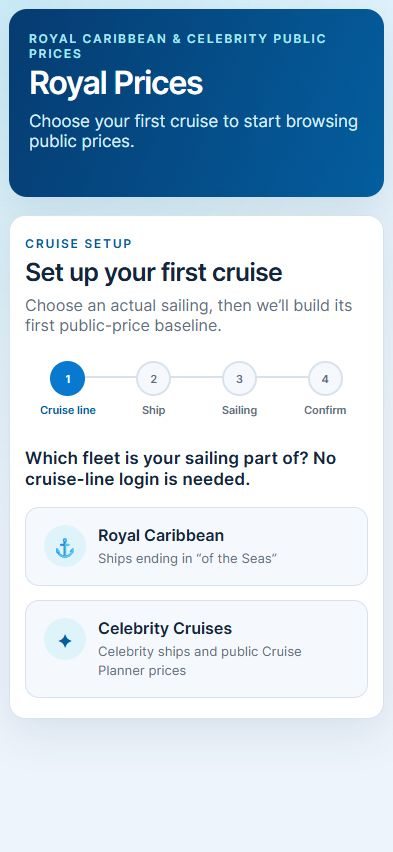

# Royal Price Dashboard

An experimental Home Assistant App that turns the public catalogs produced by
`BrowseRoyalCaribbeanPrice.py` into a searchable, multi-cruise Ingress
dashboard.

> [!IMPORTANT]
> This community project is not affiliated with, endorsed by, or supported by
> Royal Caribbean Group, Royal Caribbean International, Celebrity Cruises, or
> Home Assistant. It uses public prices, which can differ from signed-in,
> reservation-specific offers.

The App is in private release preparation and does not yet have a supported
public installation repository. The source is available for review and local
testing while installation, image publishing, and hardware validation are
completed.

On first run, **Add cruise** guides you through Royal Caribbean or Celebrity,
live public ship discovery, an actual future sailing, currency, refresh cadence,
and notification settings. Additional cruises can be added and switched from
the dashboard; no cruise-line account or reservation is required. A confirmed
**Remove cruise** action deletes only that sailing's App-private catalog,
preferences, and price history.

When a cruise reaches its calculated return date, the dashboard marks it
complete and stops price refreshes. Nothing removes the cruise automatically:
its catalog, pins, and watches stay available, while price history remains
subject to the existing retention period, until you choose
**Remove completed cruise**.

It deliberately keeps four concepts separate:

- **All** includes every catalog item and never implies notifications.
- **Pinned** items form a per-cruise shortlist while remaining in **All**.
- **History** records price and availability changes for every item, whether it
  is pinned, unpinned, watched, or unwatched.
- **Watched** items have an explicit target price and are the only items that
  can create a Home Assistant persistent notification.

Shore-excursion rows can reveal the public catalog description through a
compact **Show description** control. Descriptions remain collapsed by default,
are included in catalog searches, and are normalized to plain text before they
reach the browser.

The existing Royal Caribbean Price Check App remains independent and untouched.

## Screenshots

Clean first-run setup (mobile viewport):



Curated public-price catalog (desktop viewport):


Both screenshots use the repository's curated test fixtures, not a deployed
App or reservation. See [screenshots/README.md](screenshots/README.md).

## What it stores

Each cruise has a separate catalog, pin list, watch targets, refresh settings,
and notification setting. Compact SQLite history is keyed by ship, ISO sailing
date, currency, and product. All of that stays in the Home Assistant App's
private `/data` volume. It is not part of this source repository or Docker build
context.

No Royal Caribbean or Celebrity login is requested or stored. Exporting watches
produces a YAML snippet in the browser; it does not modify the separate price
checker automatically.

## Security boundary

- No host network, filesystem mappings, Docker API, Supervisor API, privileged
  mode, or full access.
- Home Assistant API access is used only for persistent notifications.
- Preferences and cached catalog data live in cruise-specific directories in
  the App's private `/data` volume.
- Compact per-sailing history lives in a private SQLite database. Unchanged
  refreshes do not create duplicate points, and a sailing's records expire 30
  days after its sailing date.
- The upstream browser is pinned to commit
  `bf5212c26576d468a6af2043565ece2d01f8b503` and verified by SHA-256 during
  the image build.
- `curl-cffi` is pinned alongside `requests` so the upstream browser can use
  its supported TLS-impersonation path for public endpoints that reject plain
  HTTP clients.

See [SECURITY.md](SECURITY.md) for reporting guidance and the remaining
hardening gates.

## Upstream relationship

The catalog browser comes from
[`jdeath/CheckRoyalCaribbeanPrice`](https://github.com/jdeath/CheckRoyalCaribbeanPrice).
Its MIT license is preserved in [upstream-LICENSE](upstream-LICENSE). The image
build downloads one pinned commit and fails if its SHA-256 checksum changes.
The verified upstream file stays unchanged in the image. A small local adapter
loads that exact file, requests the public shore-excursion description field,
and adds machine-readable description markers to the existing terminal output.

As of 2026-08-27, the pinned browser file is byte-for-byte identical to the
version on upstream `main`. Royal Price Dashboard still parses the upstream
terminal-oriented output; a structured JSON contract is the preferred future
integration.

## Upgrade compatibility

When a pre-0.3 installation has legacy `ship` and `sail_date` App options, the
dashboard creates a cruise registry and copies the existing root catalog and
watch preferences into that cruise's directory. Legacy hidden selections are
not converted to pins, so the initial pinned shortlist is empty. The original
files are deliberately left in place. The shared SQLite history already keys
records by ship, ISO sailing date, and currency, so prior history remains
available without a rewrite.

## Development

The App backend uses only the Python standard library at runtime; the container
also installs the dependencies required by the upstream browser. Run the local
checks with:

```text
python -m unittest discover -s tests -v
python -m py_compile server.py upstream_adapter.py tests/test_server.py
node --check static/app.js
```

Pull requests also build the `amd64` container in GitHub Actions. Docker is not
installed on the current development host, so the clean CI build is an explicit
release gate rather than locally claimed evidence.

Licensed under the [MIT License](LICENSE). Contributions are welcome after
reading [CONTRIBUTING.md](CONTRIBUTING.md). Artwork provenance and the exact
generation prompts are recorded in [ARTWORK.md](ARTWORK.md).
