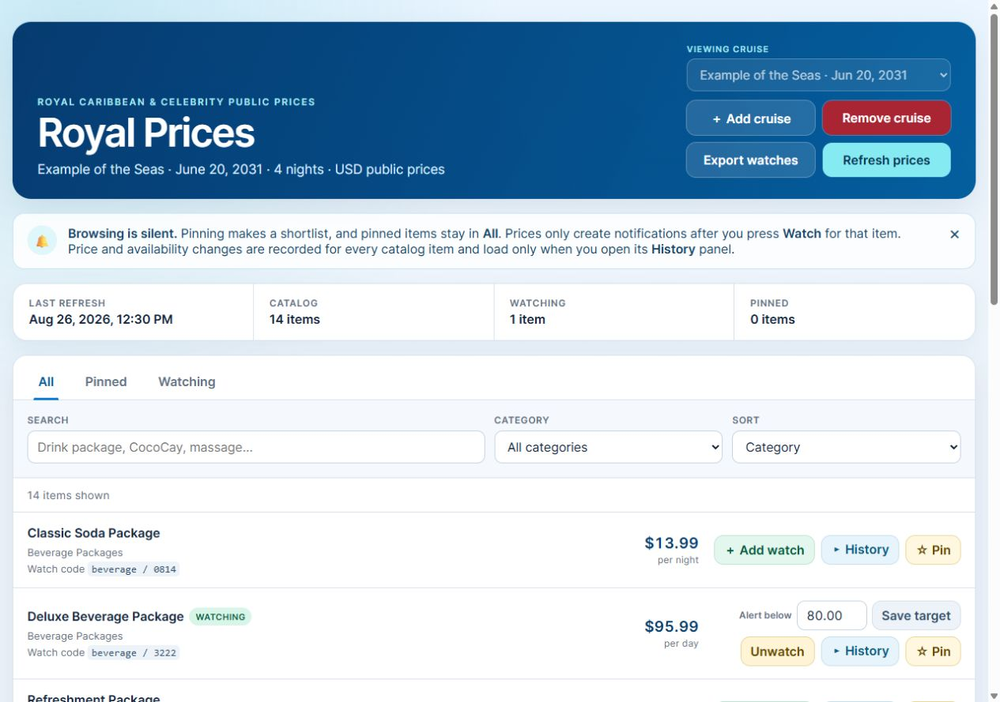

# Royal Price Dashboard

Royal Price Dashboard is an experimental Home Assistant App for browsing public
Royal Caribbean and Celebrity Cruise Planner prices, keeping per-sailing
shortlists, explicitly watching selected products, and reviewing compact price
history.

[](https://my.home-assistant.io/redirect/supervisor_add_addon_repository/?repository_url=https%3A%2F%2Fgithub.com%2FMycroftHolmesV%2FRoyalPriceDashboard)

## Installation

Royal Price Dashboard requires a Home Assistant installation with the Apps
store, such as Home Assistant OS or Home Assistant Supervised.

1. Select the **Add repository** badge above. As a manual alternative, open
   **Settings > Apps > App store**, open the top-right menu, choose
   **Repositories**, and add:

   ```text
   https://github.com/MycroftHolmesV/RoyalPriceDashboard
   ```

2. Find **Royal Price Dashboard** in the App store and select **Install**.
3. Start the App, enable **Show in sidebar** if desired, and open **Royal
   Prices**.
4. Use **Add cruise** to choose Royal Caribbean or Celebrity, a discovered
   ship, an actual future sailing, and a currency.

The repository provides signed, versioned images for `amd64` and `aarch64`.
Users do not need HACS, jdeath's Home Assistant repository, the separate Royal
Caribbean Price Check App, or a cruise-line login. The checksum-pinned jdeath
browser is packaged into this App image under its MIT license.

If you have a local development copy named `local_royal_price_dashboard`, the
repository version is a separate Home Assistant App with a separate private
`/data` volume. Installing it is not an in-place update of the local copy. Do
not remove the local copy until a separately tested migration path or an
accepted clean start is available.

## What stays separate

- Browsing the catalog never enables notifications.
- Pinning creates a shortlist and never enables notifications.
- History records price and availability changes for every product.
- Only a product that the user explicitly watches can create a Home Assistant
  persistent notification.

## Storage safety

Each cruise keeps one current catalog plus compact SQLite price and availability
history. Unchanged refreshes add no history rows, and saved history expires 30
days after the sailing. The dashboard reports both App-private data usage and
free space on the Home Assistant data filesystem.

The App warns when less than 1 GiB is free. Below 256 MiB it pauses new cruises
and catalog refreshes, while leaving existing catalogs and cruise removal
available. It never deletes an active cruise or valid history merely to recover
space. Remove an unneeded cruise to delete its catalog, preferences, and saved
history.

Royal Price Dashboard uses public prices, which can differ from signed-in or
reservation-specific offers. It is not affiliated with Royal Caribbean Group,
Royal Caribbean International, Celebrity Cruises, Home Assistant, or the
upstream project.

## Documentation

- [App overview](royal-price-dashboard/README.md)
- [User guide](royal-price-dashboard/DOCS.md)
- [Changelog](royal-price-dashboard/CHANGELOG.md)
- [Security policy](SECURITY.md)
- [Release procedure](RELEASING.md)
- [Upstream MIT license](royal-price-dashboard/upstream-LICENSE)



The screenshots use curated fixtures rather than a deployed App or reservation.

## Development

Run source checks from the App directory:

```text
cd royal-price-dashboard
python -m unittest discover -s tests -v
python -m py_compile server.py upstream_adapter.py tests/test_server.py
node --check static/app.js
```

The root `repository.yaml` and the `royal-price-dashboard` folder follow the
Home Assistant third-party App repository layout. Container publication occurs
only when a maintainer explicitly publishes a matching GitHub release. Normal
pull requests and branch pushes cannot publish images.

Licensed under the [MIT License](LICENSE). The pinned upstream browser retains
its separate [MIT notice](royal-price-dashboard/upstream-LICENSE).
